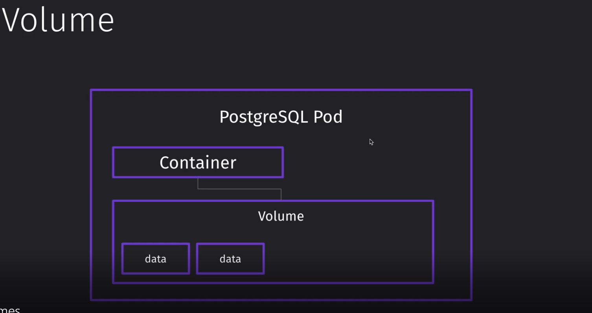
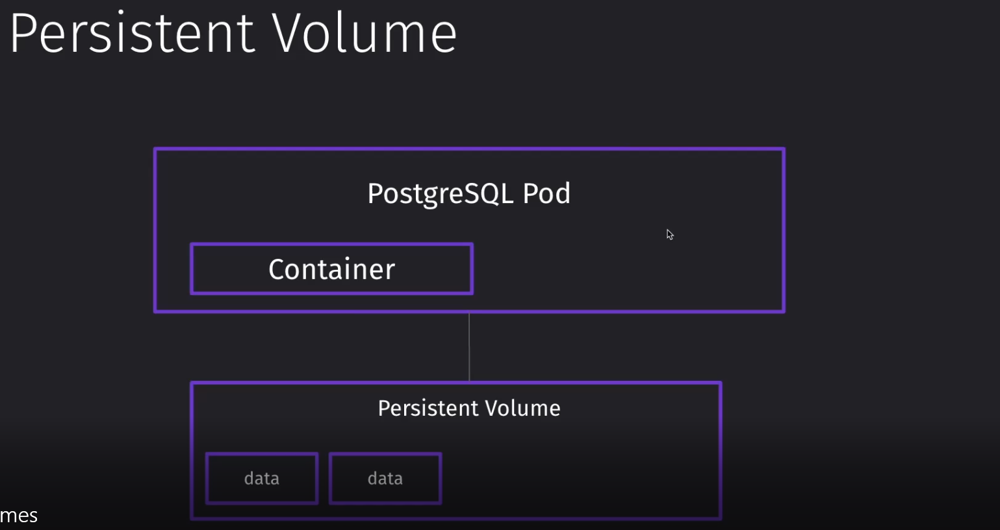
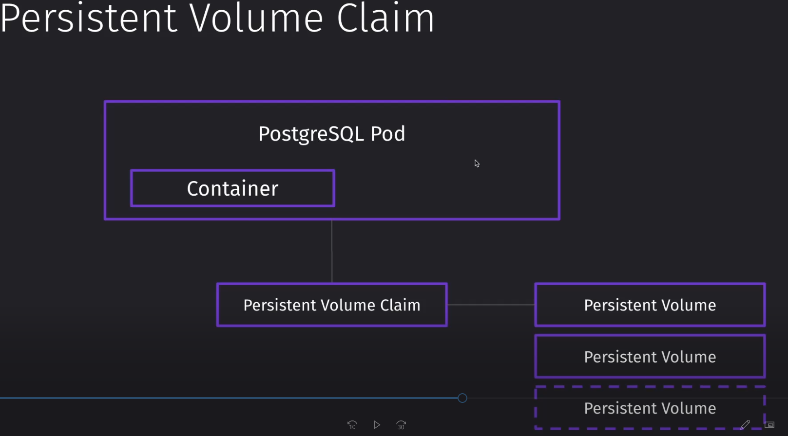
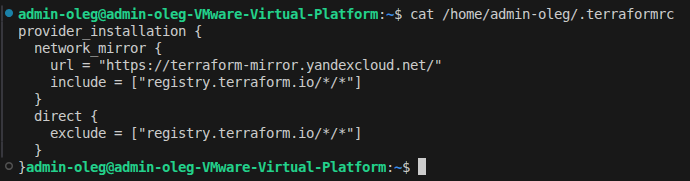
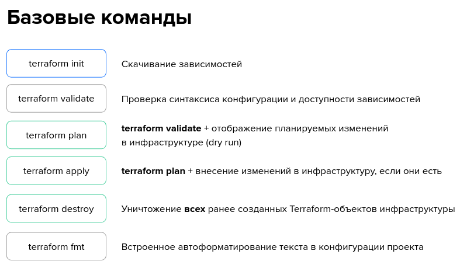

Микросервисная архитектура
------------------------------------------------------------------------------------------------------------------------------------------------
Statefull / stateless приложение

        Stateful - приложение, которое сохраняет состояние
            Пример: приложение которое стостоит из БД, СХД и тд, при этом если k8s сам по себе не хранит данные, но ходит в БД иди СХД - то это все равно является Statefull
        Stateless - приложение, которое не хранит информацию о предыдущем взаимодействии с пользователем.
            Пример: веб-сервер, которые отдает статику (Nginx например, который хранит страницу сайта)

Docker
------------------------------------------------------------------------------------------------------------------------------------------------
Состав Docker

    - Docker daemon - сервенрная часть докера , которая управляет сущностями в Docker - я бы сказал движок,
      который выполняет команды от клиенсткой части
    - Docker Cli - клиенсткая часть для работы с Docker daemon (отправляет команды, которые выполняет Docker Daemon) - например собрать image
    - Dockerfile - инструкция по которому будет собран image
    - Image - образ приложения
    - Container - контейнер в котором развернут образ, best practice 1 container = 1 image
    - Docker registry - хранилище образов

------------------------------------------------------------------------------------------------------------------------------------------------
Основные команды

    doсker search <название образа> - поиск образов в репозитории (docker registry)
    docker build -t <название образа> - сбор образа (запускать в папке или указывать путь до Dockerfile)
    docker pull <название образа> - скачивание образа из docker registry
    docker push <название образа> - загрузка образа в docker registry
    docker run <название образа> - старт контейнера
    docker ps - проверка запущенных контейнеров
    docker ps -a - проверка запущенных/завершенных контейнеров
    docker rmi <название образа> - удаление образа
    docker rm <название конетйнера> - удаление конетйнера

------------------------------------------------------------------------------------------------------------------------------------------------
Dockerfile (-y ключ выполнить интерактивно )

        FROM
        WORKDIR
        COPY
        RUN
        ENTRYPOINT - что запускаем
        нельзя в конце команды docker run image ... тут идут команды cmd
        CMD - с какими параметрами, если нет entrypoint - то CMD может выполнить роль ENTRYPOINT
        лучше использовать его чем entrypoint, по факту одно и тоже
            Форматы:
                - exec (а тут инициализируешим процессом будет приложение, например python app.py) + (не умеет работать с переменными, а shell умеет)
                - shell - НЕИСПОЛЬЗОВАТЬ ДЛЯ БИЗНЕС ПРИЛОЖЕНИЙ (OS signal - будет инициализирующим процессом, то есть главным)
        ENV - доступные
        ARG - почти равно ENV, но аргумент сборки, работает на этапе dockerfile -> docker build
        USER

------------------------------------------------------------------------------------------------------------------------------------------------
Best practice

    - При сборке image удалять кеш на слое (пример rm-rf /var/lib/apt/lists/*)
    - dockerignore - файл, в котором находятся исключения, которые не нужны в контейнере (обычно кладут в папку с Dockerfile и приложением)
    - для увеличения скорости сборки и уменьшения размера image, рекомундуется использовать облегченные базовые образы (FROM в Dockerfile)
    - Часто-изменяемые слои ставить в конец команд Dockerfile!!!!!!!, так как если в начале слой изменяется, то последующие слои тоже пересобираются
      в слоях до изменения используется кеш
    - Явное использование тегов в Dockerfile/командах для избегания разъезжания версий (например базовый образ поменялся latest,
      а докер собрал новый образ с неподдерживаем для вашего приложения базовый образ)
    - Параметризация в Dockerfile через ENV параметры (например ENV NGINX_VERSION 1.16.1-r6),  а потом подставить их в другом месте в Dockerfile
    - Multi-stage сборка - можно создать бинарь, а потом бинарник копируем в чистый образ (scratch) => не будет много слоев
    - Не запускать свои контейнеры под root, надо в Dockerfile указать USER user1, под ним будет запускаться контейнер
    - Twelve factor app

 ------------------------------------------------------------------------------------------------------------------------------------------------
Docker-compose

    docker-compose build — Cборка образа. Собранные образы помечаются, как projectservice.
    docker-compose pull — Скачивает образы из удалённого реестра в локальный Docker Registry.
    docker-compose push — Загружает образ из локально реестра в удаленный реестр (Docker Registry).
    docker-compose up (-d) — Извлекает/Собирает/Запускает контейнеры на основе указанных в stanza service: образов.
    docker-compose logs (-f) — Выводит в STDOUT логи контейнеров на основе указанных в stanza service: запущенных контейнеров.
    docker-compose ps (-a) — Выводит список запущенных контейнеров на основе указанных в stanza service: в docker-compose файле.
    docker-compose top — Выводит список запущенных процессов внутри контейнеров на основе указанных в stanza service: в docker-compose файле.
    docker-compose down -v — Останавливает все запущенные контейнеры на основе указанных в stanza service: в docker-compose файле., ключик -v удаляет еще кеширующие данные
------------------------------------------------------------------------------------------------------------------------------------------------

Kubernetes
------------------------------------------------------------------------------------------------------------------------------------------------
Service

    - Service - (https://kubernetes.io/ru/docs/concepts/services-networking/service/)- Service - (https://timeweb.cloud/tutorials/kubernetes/tipy-servisov-kubernetes-kak-vybrat)
                это объект, который используется для определения логических групп подов и правил доступа к ним.
                Поды в Kubernetes имеют временный (эфирный) характер: их можно создавать, удалять, перезапускать или перемещать между узлами кластера.
                Это делает прямой доступ к подам по их IP-адресам ненадежным. Сервисы решают эту проблему, предоставляя стабильный сетевой интерфейс для взаимодействия с подами.
                Каждый сервис получает виртуальный IP-адрес (ClusterIP) или DNS-имя, через которые можно обращаться к группе подов, даже если сами поды меняются.
        type:
            - ClusterIP:
                Тип сервиса, который используется в Kubernetes по умолчанию.
                Сервис создает виртуальный IP-адрес внутри кластера, который используется для доступа к подам, соответствующим селектору сервиса.
                ClusterIP обеспечивает внутреннюю маршрутизацию трафика, то есть доступ возможен только внутри кластера без доступа во внешнюю сеть.
                Данный тип сервиса подходит для приложений, которые взаимодействуют только с другими компонентами внутри кластера

                Особенности:
                    - Используется виртуальный IP-адрес для сетевого взаимодействия только внутри кластера.
                    - Балансировка трафика происходит между подами, которые соответствуют селектору сервиса.
                    - Подходит для работы со внутренними сервисами — СУБД, API, брокеры сообщений (когда развернуты в кластере).

            - NodePort:
                Сервис типа NodePort открывает доступ к подам через порт на каждом узле кластера.
                Kubernetes выделяет порт из диапазона 30000–32767 (по умолчанию) и привязывает его к сервису.(пример, берем ip кластера (minikube ip), обращаемся к нему по порту 30000–32767)
                Это позволяет внешним клиентам обращаться к приложению через IP-адрес любого узла кластера и назначенный порт.
                NodePort часто используют для тестирования или в тех случаях, где требуется прямой доступ к сервису без использования внешнего балансировщика нагрузки.

                Особенности
                    - Доступ к приложениям возможен через комбинацию IP-адреса узла кластера и номера порта.
                    - Сервис также обладает внутренним адресом ClusterIP, что позволяет использовать его внутри кластера.
                    - Подходит для временного доступа или для использования в кластерах без внешнего балансировщика нагрузки.

            - LoadBalancer
                Обеспечивает доступ к приложениям в кластере через балансировщик нагрузки, созданный в облачной инфраструктуре.
                Этот тип сервиса автоматически присваивает внешний IP-адрес для доступа пользователей к приложению.
                LoadBalancer можно использовать для production-приложений, где важны высокая доступность и масштабируемость.

                Особенности
                    - Создает внешний IP-адрес, доступный из внешней сети.
                    - Интегрируется с облачными балансировщиками нагрузки.
                    - Включает функциональность ClusterIP и NodePort.

            - ExternalName
            - Headless Service

        _!!!ВАЖНО!!! - взаимодействие service и pod завязано на selector (selector service -> label pod (только тогда service увидит под))_
------------------------------------------------------------------------------------------------------------------------------------------------
RBAC

------------------------------------------------------------------------------------------------------------------------------------------------
MTLS

------------------------------------------------------------------------------------------------------------------------------------------------
Volume/Persistent Volume/PVC/Storage classes

https://habr.com/ru/companies/T1Holding/articles/781368/?ysclid=mjsdt85ddl491088579

        - Volume 
            - хранилище внутри пода, если под рестартует, хранилище будем пустым

------------------------------------------------------------------------------------------------------------------------------------------------
        - Persistent volume
            - хранилище вне пода, если под рестартует, хранилище будем оставаться с данными
        Особенности:
            - Статическое создание -  В статическом режиме администратор заранее создаёт ряд PV с различными характеристиками.
            - Динамическое создание -  В динамическом режиме PV создаётся «на лету» на основе требований, указанных в PersistentVolumeClaim (PVC)

------------------------------------------------------------------------------------------------------------------------------------------------
        - Persistent volume claim
            - требование пода взаимодействовать с Persistent volume, k8s выделаяет Persistent volume (PV)
        - Принципы работы PVC:
            - Декларативность: PVC создаётся через YAML-файл, который описывает требуемые параметры хранилища, такие, как размер, тип и режимы доступа.
            - Динамическое выделение: если в кластере настроены Storage Classes, то PVC может динамически создавать PersistentVolumes (PV) на основе этих классов.
            - Привязка к PV: после создания PVC автоматически привязывается к соответствующему PV. Если подходящего PV нет, то PVC остаётся в состоянии Pending до тех пор, пока не будет найден или создан подходящий PV.
            - Изоляция ресурсов: PVC обеспечивает изоляцию хранилища между различными приложениями и пользователями, позволяя каждому из них иметь свои собственные требования к хранилищу.
        - Access Modes
            - ReadWriteOnce (RWO) - один узел может писать и читать
            - ReadOnlyMany (ROX) - много узлов могут читать
            - ReadWriteMany (RWX) - много узлов могут читать и писать

------------------------------------------------------------------------------------------------------------------------------------------------   
        - Storage classes
            - Представляет собой способ описания классов хранилища, которые можно использовать для динамического выделения PersistentVolumes (PV) при создании PersistentVolumeClaims (PVC).
            - Storage Class определяет, какой провайдер хранилища будет использоваться, какие параметры будут применены и другие специфические для провайдера настройки.
 ------------------------------------------------------------------------------------------------------------------------------------------------   
Применение в Deployment:

        **!!!ВАЖНО!!! volumes устанавливаеится на уровне container в деплолймент при связывании pvc и пода !!!ВАЖНО!!!**
        **!!!ВАЖНО!!! А вот volumeMounts устанавливаеится в  container, чторбы смонтировать каталог в контейнере пода в хранилище PV!!!ВАЖНО!!!** 
        mountPath: /data  - место в контейнере куда будет смонтировано хранилище PV
        subPath: "" - если в PV есть несколько каталогов, то указываем в каком каталоге будет хранится данные (ВАЖНО subpath - это путь в PV!!!)
------------------------------------------------------------------------------------------------------------------------------------------------   
    - Configmap
        - Объект, который используется для хранения и передачи конфигурационных данных в контейнеры.    
            1. Способ через envFrom (переменные окружения) (Каждый ключ ConfigMap превращается в переменную окружения контейнера. Где хранятся: в оперативной памяти контейнера (не в файловой системе))
                spec:
                    volumes:    
                      configMap:
                        name: hcms-admin
                        defaultMode: 420
                    containers:
                      envFrom:
                        - configMapRef:
                           name: hcms-admin
              2. Способ через volumeMounts (файловая система)  - происходит монтирование в конкретную точку
                spec:
                    volumes:    
                      configMap:
                        name: hcms-admin
                        defaultMode: 420
                    containers:
                      volumeMounts:
                        - name: hcms-admin
                          mountPath: /hcms-admin/language.yml
                          subPath: language.yml                - отдельно возьмет параметр из конфигмапы (при этом в конфигмапе есть другие ключи помимо language.yml) (если subpath не указан, то возьмет все что есть в конфигмапе)
                          readOnly: true
------------------------------------------------------------------------------------------------------------------------------------------------  
    - Secrets
    - HPA
    - StatefullSet - объект хранит состояние, это альтернатива deployment, которая может хранить состояние с помощью PVC
        - Создает под с одинаковым именем и идентификатором с 0 до n 
------------------------------------------------------------------------------------------------------------------------------------------------
DaemonSet

------------------------------------------------------------------------------------------------------------------------------------------------
HELM

------------------------------------------------------------------------------------------------------------------------------------------------
        Установка (https://helm.sh/docs/intro/install/)
            sudo apt-get install curl gpg apt-transport-https --yes
            curl -fsSL https://packages.buildkite.com/helm-linux/helm-debian/gpgkey | gpg --dearmor | sudo tee /usr/share/keyrings/helm.gpg > /dev/null
            echo "deb [signed-by=/usr/share/keyrings/helm.gpg] https://packages.buildkite.com/helm-linux/helm-debian/any/ any main" | sudo tee /etc/apt/sources.list.d/helm-stable-debian.list
            sudo apt-get update
            sudo apt-get install helm
        ---------------------------------------------------------------------------------------------
        Команды:
            - helm search hub/repo
                hub - поиск чарта в репозитории локально
                repo - репозитория с чартами
            - helm repo add bitnami https://charts.bitnami.com/bitnami  - добавить репозиторий с чартами локально на машину
            - helm repo update - обновить все репозитории локально на машине
            - helm repo remove <название репозитория>  - удаление репозитория

            - helm install <название чарта>  - установка чарта
                helm install my-release oci://registry-1.docker.io/bitnamicharts/nginx
                или
                helm install wordpress  oci://registry-1.docker.io/bitnamicharts/wordpress
            - helm upgrade <название чарта>   - обновить чарт
            - helm pull <название чарта>  - скачать чарт
                helm pull oci://registry-1.docker.io/bitnamicharts/nginx
                Далее можно распокавать архив tgz
                    - tar xvf nginx-22.3.9.tgz
            -
             helm show <название чарта> - информация о чарте
            - helm list - список установленных чартов в k8s
            - helm uninstall/delete <название релиза> - удаление чарта
            - helm create <название чарта> - создает стартер (базовый набор шаблонов)
        ---------------------------------------------------------------------------------------------

        Хуки (нужны для тестов, они не являются частью релиза и их нужно удалять с помоьщью аннотации helm.sh/hook-delete-policy: hook-succeeded)
        пример
            helm.sh/hook: pre-install
            helm.sh/hook-weight: "-5"
            helm.sh/hook-delete-policy: hook-succeeded
        ---------------------------------------------------------------------------------------------

        P.S
        admin-oleg@admin-oleg-VMware-Virtual-Platform:~/Desktop/slurm-school-dev/school-dev-k8s/practice/18.templating$ kubectl get svc
        NAME                         TYPE           CLUSTER-IP       EXTERNAL-IP   PORT(S)                      AGE
        kubernetes                   ClusterIP      10.96.0.1        <none>        443/TCP                      24h
        wordpress                    LoadBalancer   10.101.232.247   <pending>     80:31794/TCP,443:32703/TCP   15m
        wordpress-mariadb            ClusterIP      10.102.174.239   <none>        3306/TCP                     15m
        wordpress-mariadb-headless   ClusterIP      None             <none>        3306/TCP                     15m
        kubectl port-forward svc/wordpress 8080:80 - без TLS
        kubectl port-forward svc/wordpress 8443:443 - c TLS
------------------------------------------------------------------------------------------------------------------------------------------------
istio
    - Destination Rule
    - Virtual Service
    - Service Entry
    - Envoy Filter
    - Ingress/Egress Gateway
    - Peer Auntification

Postgres
Redis
Kafka
Ansible
Terraform

        файл .terraformrc - должен находиться в домашнем каталоге (например: /home/admin-oleg)
        Данный файл содержит информацию о регистри, откуда можно скачать провайдер
        

        Базовые команды
        
        terramorm init - инициализирует рабочую директорию Terraform, выполняя следующие ключевые операции:
            Загрузка провайдеров: Скачиваются необходимые плагины-провайдеры, указанные в файле конфигурации (например, AWS, Google Cloud, Azure). Эти провайдеры обеспечивают интеграцию с облачными сервисами и позволяют управлять ресурсами инфраструктуры.

            Инициализация backend: Если указан backend-конфигурация (например, S3 для хранения состояния Terraform), эта команда настроит подключение к нему и подготовит хранение состояний ресурсов.
            
            Подготовка модулей: Если ваш проект включает внешние модули (например, подключённые с помощью Git или HTTPS), команда скачает и установит их.
            
            Проверка конфигураций: Проверяются синтаксически правильные конфигурации Terraform (HCL).
            
            Создание рабочего каталога. Создается скрытая папка .terraform, в которой хранятся внутренние данные и метаданные, включая загруженные провайдеры и модули.
 ------------------------------------------------------------------------------------------------------------------------------------------------       
        terraform { … } - Это начало блока настроек самого инструмента Terraform. Внутри него содержатся глобальные настройки проекта.
        
        required_providers { … }
        Здесь указывается список необходимых провайдеров (провайдеры позволяют взаимодействовать с различными облачными сервисами, платформами или системами). Каждый проект может зависеть от определённых провайдеров, которые необходимы для выполнения нужных операций.
        
        docker = { … }
        Эта запись обозначает, что проекту необходим провайдер Docker. Название ("docker") задаёт псевдоним, под которым этот провайдер будет использоваться внутри файла.
        
        source = "kreuzwerker/docker"
        Параметр source определяет источник провайдера. Здесь указано, откуда именно Terraform берёт нужный провайдер. В данном примере источником является "kreuzwerker/docker", что означает официальный репозиторий провайдера Docker от разработчика Kreuzwerker.

        Итог: Данный код настраивает использование официального провайдера Docker для взаимодействия с контейнерами Docker в рамках вашего проекта Terraform.
        
------------------------------------------------------------------------------------------------------------------------------------------------
        # Для удаленной тачки нужно добавить пользователя в группу докер, чтобы не вызывать постоянно sudo
        sudo groupadd docker          # Создать группу docker (если её нет)
        sudo usermod -aG docker test-user  # Добавить пользователя в группу docker
        newgrp docker    
------------------------------------------------------------------------------------------------------------------------------------------------