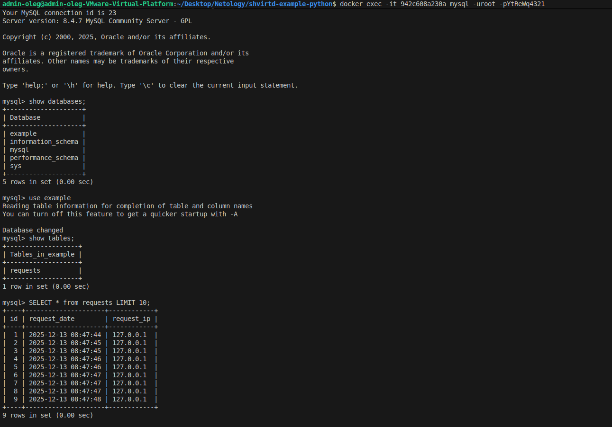
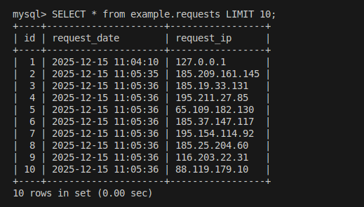
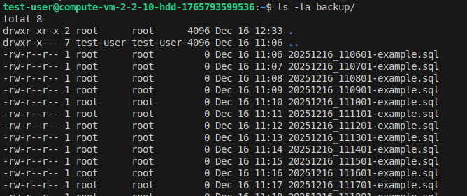
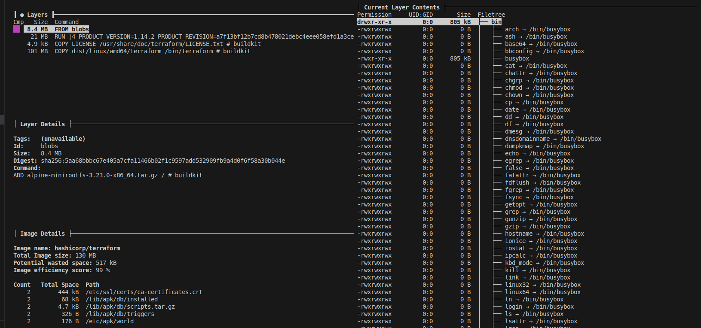
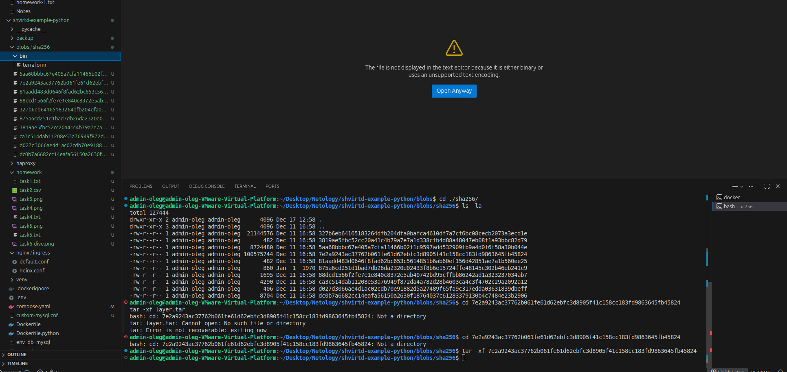
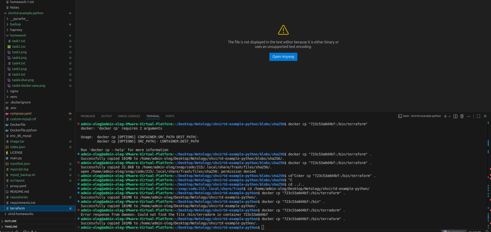

Задача 1 (*)
- Приложение запущено локально
- mysql запущена в docker container
------------------------------------------------------------------------------------------------------------------------------------------------

Действия:
Приложение запущенное локально:
### 2. Локальный запуск для разработки

    ```bash
    # Создайте виртуальное окружение
    python3 -m venv venv
    source venv/bin/activate  # в Windows: venv\Scripts\activate

    # Установите зависимости
    pip install -r requirements.txt

    # Настройте переменные окружения для подключения к БД(не забудьте отдельно запустить БД)
    export DB_HOST='127.0.0.1'
    export DB_USER='app'  
    export DB_PASSWORD='very_strong'
    export DB_NAME='example'

    # Запустите приложение
    uvicorn main:app --host 0.0.0.0 --port 5000 --reload

------------------------------------------------------------------------------------------------------------------------------------------------

mysql:
- docker run -d --name mysql -p 3306:3306 -e MYSQL_ROOT_PASSWORD=123qwe mysql:lates - запуск mysql в docker container
- docker exec -it mysql bash - проваливаемся в докер контейнер
- mysql -u root -p - используем утилиту mysql вводя пароль из переменной MYSQL_ROOT_PASSWORD
- Выполняем:
  CREATE DATABASE example;
  CREATE USER 'app'@'%' IDENTIFIED BY 'very_strong';  
  GRANT ALL PRIVILEGES ON example.* TO 'app'@'localhost';
  FLUSH PRIVILEGES;

*** в первоначально инструкции CREATE USER 'app'@'localhost' IDENTIFIED BY 'very_strong';
При попытке подключиться с локальной машины в докер контейнер, будет выводиться ошибка
curl localhost:5000/ - Ошибка при работе с базой данных: 1045 (28000): Access denied for user 'app'@'172.17.0.1' (using password: YES)"
Проблема возникает потому, что MySQL не разрешает удалённое соединение пользователю 'app', даже если вы указали пароль и имя пользователя верно. Причина кроется в следующем:
Вы создали пользователя 'app' только для подключения с хоста 'localhost'. Это означает, что попытки входа с другого адреса будут отклоняться.
Ваш сервер FastAPI находится вне контейнера Docker, следовательно, пытается соединиться с MySQL снаружи, а адрес вашей машины Docker видит как внешний ('172.17.0.1'), а не как 'localhost'.

После этого, если прокинуть curl localhost:5000/ - получим ответ "TIME: 2025-12-12 16:40:33, IP: похоже, что вы направляете запрос в неверный порт(например curl http://127.0.0.1:5000). Правильное выполнение задания - отправить запрос в порт 8090."------------------------------------------------------------------------------------------------------------------------------------------------

------------------------------------------------------------------------------------------------------------------------------------------------

Задание 2
name,link,severity,package,version,fixedBy
CVE-2025-14104,https://avd.aquasec.com/nvd/cve-2025-14104,MEDIUM,bsdutils,1:2.41-5,
CVE-2025-14104,https://avd.aquasec.com/nvd/cve-2025-14104,MEDIUM,libblkid1,2.41-5,
CVE-2025-14104,https://avd.aquasec.com/nvd/cve-2025-14104,MEDIUM,liblastlog2-2,2.41-5,
CVE-2025-14104,https://avd.aquasec.com/nvd/cve-2025-14104,MEDIUM,libmount1,2.41-5,
CVE-2025-14104,https://avd.aquasec.com/nvd/cve-2025-14104,MEDIUM,libsmartcols1,2.41-5,
CVE-2025-7709,https://avd.aquasec.com/nvd/cve-2025-7709,MEDIUM,libsqlite3-0,3.46.1-7,
CVE-2025-14104,https://avd.aquasec.com/nvd/cve-2025-14104,MEDIUM,libuuid1,2.41-5,
CVE-2025-14104,https://avd.aquasec.com/nvd/cve-2025-14104,MEDIUM,login,1:4.16.0-2+really2.41-5,
CVE-2025-14104,https://avd.aquasec.com/nvd/cve-2025-14104,MEDIUM,mount,2.41-5,
CVE-2025-14104,https://avd.aquasec.com/nvd/cve-2025-14104,MEDIUM,util-linux,2.41-5,
CVE-2011-3374,https://avd.aquasec.com/nvd/cve-2011-3374,LOW,apt,3.0.3,
TEMP-0841856-B18BAF,https://security-tracker.debian.org/tracker/TEMP-0841856-B18BAF,LOW,bash,5.2.37-2+b5,
CVE-2022-0563,https://avd.aquasec.com/nvd/cve-2022-0563,LOW,bsdutils,1:2.41-5,
CVE-2017-18018,https://avd.aquasec.com/nvd/cve-2017-18018,LOW,coreutils,9.7-3,
CVE-2025-5278,https://avd.aquasec.com/nvd/cve-2025-5278,LOW,coreutils,9.7-3,
CVE-2011-3374,https://avd.aquasec.com/nvd/cve-2011-3374,LOW,libapt-pkg7.0,3.0.3,
CVE-2022-0563,https://avd.aquasec.com/nvd/cve-2022-0563,LOW,libblkid1,2.41-5,
CVE-2010-4756,https://avd.aquasec.com/nvd/cve-2010-4756,LOW,libc-bin,2.41-12,
CVE-2018-20796,https://avd.aquasec.com/nvd/cve-2018-20796,LOW,libc-bin,2.41-12,
CVE-2019-1010022,https://avd.aquasec.com/nvd/cve-2019-1010022,LOW,libc-bin,2.41-12,
CVE-2019-1010023,https://avd.aquasec.com/nvd/cve-2019-1010023,LOW,libc-bin,2.41-12,
CVE-2019-1010024,https://avd.aquasec.com/nvd/cve-2019-1010024,LOW,libc-bin,2.41-12,
CVE-2019-1010025,https://avd.aquasec.com/nvd/cve-2019-1010025,LOW,libc-bin,2.41-12,
CVE-2019-9192,https://avd.aquasec.com/nvd/cve-2019-9192,LOW,libc-bin,2.41-12,
CVE-2010-4756,https://avd.aquasec.com/nvd/cve-2010-4756,LOW,libc6,2.41-12,
CVE-2018-20796,https://avd.aquasec.com/nvd/cve-2018-20796,LOW,libc6,2.41-12,
CVE-2019-1010022,https://avd.aquasec.com/nvd/cve-2019-1010022,LOW,libc6,2.41-12,
CVE-2019-1010023,https://avd.aquasec.com/nvd/cve-2019-1010023,LOW,libc6,2.41-12,
CVE-2019-1010024,https://avd.aquasec.com/nvd/cve-2019-1010024,LOW,libc6,2.41-12,
CVE-2019-1010025,https://avd.aquasec.com/nvd/cve-2019-1010025,LOW,libc6,2.41-12,
CVE-2019-9192,https://avd.aquasec.com/nvd/cve-2019-9192,LOW,libc6,2.41-12,
CVE-2022-0563,https://avd.aquasec.com/nvd/cve-2022-0563,LOW,liblastlog2-2,2.41-5,
CVE-2022-0563,https://avd.aquasec.com/nvd/cve-2022-0563,LOW,libmount1,2.41-5,
CVE-2025-6141,https://avd.aquasec.com/nvd/cve-2025-6141,LOW,libncursesw6,6.5+20250216-2,
CVE-2022-0563,https://avd.aquasec.com/nvd/cve-2022-0563,LOW,libsmartcols1,2.41-5,
CVE-2021-45346,https://avd.aquasec.com/nvd/cve-2021-45346,LOW,libsqlite3-0,3.46.1-7,
CVE-2013-4392,https://avd.aquasec.com/nvd/cve-2013-4392,LOW,libsystemd0,257.9-1~deb13u1,
CVE-2023-31437,https://avd.aquasec.com/nvd/cve-2023-31437,LOW,libsystemd0,257.9-1~deb13u1,
CVE-2023-31438,https://avd.aquasec.com/nvd/cve-2023-31438,LOW,libsystemd0,257.9-1~deb13u1,
CVE-2023-31439,https://avd.aquasec.com/nvd/cve-2023-31439,LOW,libsystemd0,257.9-1~deb13u1,
CVE-2025-6141,https://avd.aquasec.com/nvd/cve-2025-6141,LOW,libtinfo6,6.5+20250216-2,
CVE-2013-4392,https://avd.aquasec.com/nvd/cve-2013-4392,LOW,libudev1,257.9-1~deb13u1,
CVE-2023-31437,https://avd.aquasec.com/nvd/cve-2023-31437,LOW,libudev1,257.9-1~deb13u1,
CVE-2023-31438,https://avd.aquasec.com/nvd/cve-2023-31438,LOW,libudev1,257.9-1~deb13u1,
CVE-2023-31439,https://avd.aquasec.com/nvd/cve-2023-31439,LOW,libudev1,257.9-1~deb13u1,
CVE-2022-0563,https://avd.aquasec.com/nvd/cve-2022-0563,LOW,libuuid1,2.41-5,
CVE-2022-0563,https://avd.aquasec.com/nvd/cve-2022-0563,LOW,login,1:4.16.0-2+really2.41-5,
CVE-2007-5686,https://avd.aquasec.com/nvd/cve-2007-5686,LOW,login.defs,1:4.17.4-2,
CVE-2024-56433,https://avd.aquasec.com/nvd/cve-2024-56433,LOW,login.defs,1:4.17.4-2,
TEMP-0628843-DBAD28,https://security-tracker.debian.org/tracker/TEMP-0628843-DBAD28,LOW,login.defs,1:4.17.4-2,
CVE-2022-0563,https://avd.aquasec.com/nvd/cve-2022-0563,LOW,mount,2.41-5,
CVE-2025-6141,https://avd.aquasec.com/nvd/cve-2025-6141,LOW,ncurses-base,6.5+20250216-2,
CVE-2025-6141,https://avd.aquasec.com/nvd/cve-2025-6141,LOW,ncurses-bin,6.5+20250216-2,
CVE-2007-5686,https://avd.aquasec.com/nvd/cve-2007-5686,LOW,passwd,1:4.17.4-2,
CVE-2024-56433,https://avd.aquasec.com/nvd/cve-2024-56433,LOW,passwd,1:4.17.4-2,
TEMP-0628843-DBAD28,https://security-tracker.debian.org/tracker/TEMP-0628843-DBAD28,LOW,passwd,1:4.17.4-2,
CVE-2011-4116,https://avd.aquasec.com/nvd/cve-2011-4116,LOW,perl-base,5.40.1-6,
TEMP-0517018-A83CE6,https://security-tracker.debian.org/tracker/TEMP-0517018-A83CE6,LOW,sysvinit-utils,3.14-4,
CVE-2005-2541,https://avd.aquasec.com/nvd/cve-2005-2541,LOW,tar,1.35+dfsg-3.1,
TEMP-0290435-0B57B5,https://security-tracker.debian.org/tracker/TEMP-0290435-0B57B5,LOW,tar,1.35+dfsg-3.1,
CVE-2022-0563,https://avd.aquasec.com/nvd/cve-2022-0563,LOW,util-linux,2.41-5,

------------------------------------------------------------------------------------------------------------------------------------------------

Задание 3
 - результат работы приложения на ВМ в контейнерах

------------------------------------------------------------------------------------------------------------------------------------------------

Задание 4
 - результат работы приложения на виртуалке в yandex cloud в контейнерах
https://github.com/olegmanzhay/Netology/tree/master/shvirtd-example-python - fork

------------------------------------------------------------------------------------------------------------------------------------------------

Задание 5
Скрипт
test-user@compute-vm-2-2-10-hdd-1765793599536:~$ cat /opt/Netology/shvirtd-example-python/script.sh
#!/bin/bash

# Имя контейнера базы данных
DB_CONTAINER="shvirtd-example-python-db-1"
NETWORK="shvirtd-example-python_backend"

# Логин и пароль для MySQL (получено из export PASS)
MYSQL_ROOT="root"
MYSQL_ROOT_PASSWORD=$PASS

# Имя базы данных
DB_NAME="example"

# Дата для имени файла резервной копии
DATE=$(date "+%Y%m%d_%H%M%S")

# Папка для сохранения резервных копий
BACKUP_DIR="backup"

# Создаём директорию для резервных копий, если её ещё нет
if [[ ! -d "$BACKUP_DIR" ]]; then
sudo mkdir -p "$BACKUP_DIR"
fi

# Команда для резервного копирования (перенаправляем прямо в контейнер)
    docker run \
    --rm --entrypoint "" \
    --network $NETWORK \
    -v ./backup:/backup \
    schnitzler/mysqldump \
    mysqldump --opt -h $DB_CONTAINER  -u $MYSQL_ROOT -p$MYSQL_ROOT_PASSWORD "--result-file=/backup/$DATE-$DB_NAME.sql" $DB_NAME


echo "Резервная копия выполнена!"


 - результат работы скрипта при выполнении бекапа

------------------------------------------------------------------------------------------------------------------------------------------------

Задание 6
 - Результат использования dive
 - результат использования docker save
 - результат использования docker cp

------------------------------------------------------------------------------------------------------------------------------------------------